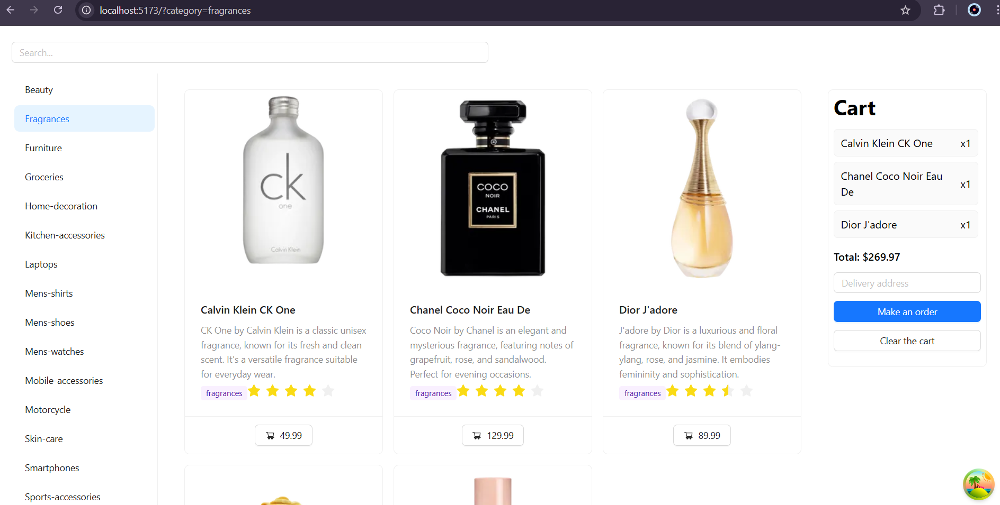

# My Zustand App

Frontend-проект каталога товаров с фильтрацией, поиском и корзиной на `React + Vite`, с упором на простой UX, адаптивность и предсказуемое управление состоянием.



## Project Overview

Цель проекта — реализовать удобный интерфейс каталога, где пользователь может:
- просматривать товары по категориям;
- искать товары по названию;
- добавлять позиции в корзину;
- оформлять заказ с базовой валидацией адреса.

Данные подгружаются из `DummyJSON API`, а клиентское состояние управляется через `Zustand` и `React Query`.

## Tech Stack

- `React 19` — UI-слой и компонентная архитектура.
- `TypeScript` — типизация моделей, пропсов и store-контрактов.
- `Vite 7` — dev-сервер и production-сборка.
- `Zustand` (`devtools`, `persist`) — хранение состояния каталога и корзины.
- `@tanstack/react-query` — запросы, кэш и асинхронные состояния загрузки.
- `React Router DOM` — маршрутизация и синхронизация UI с URL.
- `Ant Design` — UI-компоненты (`Card`, `Menu`, `Input`, `Button`, `Drawer`, `Skeleton`, `message`).
- `Axios` — HTTP-запросы к внешнему API.
- `Immer` — безопасные обновления структуры корзины.
- `ESLint` — статический анализ кода.

## Architecture

Проект организован по функциональным областям:

- `src/components/`  
  Визуальные блоки интерфейса: список карточек, карточка товара, фильтры категорий, поиск, корзина.

- `src/model/`  
  Состояние приложения на `Zustand`:
  - `productStore` — товары, категории, параметры фильтрации;
  - `cartSlice` — корзина, очистка, `persist`-гидрация.

- `src/helpers/`  
  Кастомные хуки и утилиты (`useCustomQuery`, `useMutateCart`, синхронизация параметров).

- `src/types/`  
  Доменные типы для продуктов, корзины и API-контрактов.

- `src/api/`  
  API-константы для работы с корзиной.

## Key Features

- Каталог товаров с фильтрацией по категориям и поиском.
- Корзина с сохранением состояния через `persist` (между перезагрузками страницы).
- Валидация адреса при оформлении заказа и уведомление об успешном заказе.
- Скелетоны загрузки и стабилизация layout во время загрузки.
- Адаптивный интерфейс:
  - на desktop категории отображаются сбоку;
  - на mobile категории открываются в `Drawer`.

## UX Notes

- Список карточек и корзина имеют стабильные контейнеры во время загрузки, что снижает визуальные скачки.
- Корзина оформлена как отдельная панель с фиксированной структурой блоков.
- На мобильных устройствах фильтры скрыты в боковую панель, чтобы не перегружать экран.

## Developer Guide

### Requirements

- `Node.js 20+` (рекомендуется актуальная LTS-версия)
- `npm`

### Install

```bash
npm install
```

### Run (dev)

```bash
npm run dev
```

Приложение будет доступно в браузере по адресу, который покажет Vite (обычно `http://localhost:5173`).

### Production Build

```bash
npm run build
```

### Preview Build

```bash
npm run preview
```

### Lint

```bash
npm run lint
```

## API

Проект использует публичный API:
- продукты и категории: `https://dummyjson.com/products`
- корзина: `https://dummyjson.com/carts/add`


